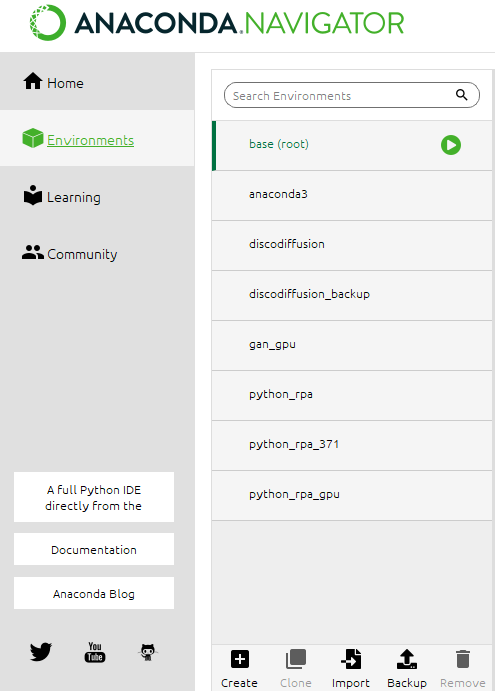
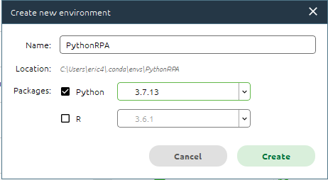
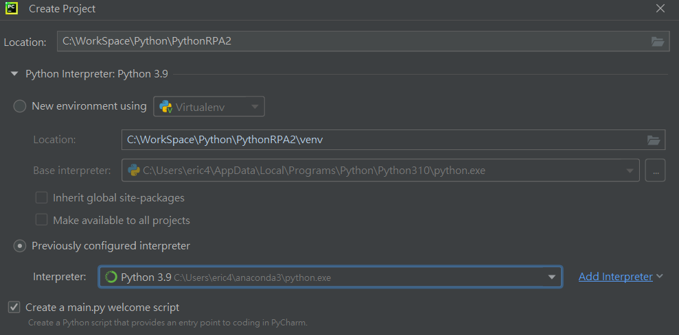

環境建置
===

一、安裝
---
1. ANACONDA：https://repo.anaconda.com/archive/Anaconda3-2022.10-Windows-x86_64.exe
2. PYCHARM：https://www.jetbrains.com/pycharm/download/download-thanks.html?platform=windows&code=PCC

二、環境配置
---

1. ANACONDA : 

>選擇 Create

>安裝 Python Version 3.7.13

>選擇 Open Terminal

>在 Terminal 視窗內安裝 Python 套件:
安裝 opencv  
pip install numpy==1.15.3  
pip install matplotlib==3.0.1  
pip install opencv-python==3.4.2.16  
pip install opencv-contrib-python==3.4.2.16
安裝 PyWin32 用於視窗相關控制  
pip install --ignore-installed --upgrade PyWin32
安裝 pyautogui 用於 RPA 相關操作  
pip install --ignore-installed --upgrade pyautogui

2. PYCHARM 設置 ANACONDA 

>建立新專，選擇 Add interpreter

>再 Anaconda 找到剛建立的環境

三、Download Source Code
---

https://github.com/DarkShadowTW/PythonRPA

．Ex*.py：達到各種 RPA 的範列程式  
．LibRPA.py：Library 將 RPA 程式寫好類 exist, click 等語法，以及目前畫面放大縮小  
．Scenario1.py：縮小 PyChram 畫面找三個 ICON 移動滑鼠，並且按下 Click
．Scenario2.py：縮小 PyChram 並把 Loop Hero 開到最大，直到按下 Ctrl + C 才回到 PyCharm

